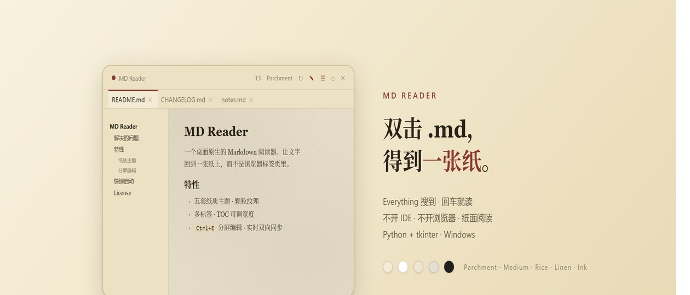

**[English](README.md)** · **简体中文**

# MD Reader



> 为了看 Claude Code 写的 Markdown 文档，做的一个桌面阅读器（含 Claude Code Skill）。

⭐ **装完 skill，让 Claude Code 写完文档直接开窗** —— 你不用再手动找文件、双击打开，CC 生成完，渲染后的窗口已经在你面前了。
⭐ **Everything 搜到文件直接双击打开** —— 不用 Obsidian、不用 IDE、不用任何第三方阅读器，就是一份 md 一个窗口。

这两件事，就是 MD Reader 想解决的全部问题。

## 解决什么问题

Markdown 是我日常最重的文件格式。方案、周报、随手的想法、Agent 跑完丢给我的结果，几乎都是一份份 `.md` 散落在硬盘各处。但"怎么打开来看"这一步一直很别扭：

- **系统自带的记事本**不渲染 Markdown，一堆 `#` `*` `>` 符号直接劝退
- **浏览器预览**地址栏/标签栏/插件图标都在抢视觉，像在看网页不像在看文档
- **Obsidian** 渲染得很漂亮，但非要我先打开一整个仓库，有时候还一直转圈加载不出来 —— 我只是想看一个文件而已，为什么要先进一个"知识库"
- **IDE（Qoder / Cursor / VSCode）** 确实能渲染 md，但它们本质是开发工具，为一个阅读需求拉起一整个 IDE，开机慢、内存大、视觉嘈杂
- **HTA / mshta** 是系统对话框的长相，丑且没独立感

而 Claude Code 场景下更尴尬：CC 在终端里写完一份文档，光标停在那里等着我，我还得切出去、找文件、双击、等窗口起来 —— Agent 的速度和我的速度之间，隔了好几次手动操作。

MD Reader 就是为这两个场景存在的一个极轻的桌面 Markdown 阅读器：**Everything 搜到 → 回车 → 一张纸**；**Claude Code 写完 → skill 自动开窗 → 一张纸**。frameless 圆角窗口、纸质主题、颗粒纹理、衬线字体、可拖拽 TOC、多标签、分屏编辑。打开快、视觉干净，像桌面小程序而不是文档查看器。需要改点什么？`Ctrl+E` 当场分屏编辑，自动保存回原文件。

如果 AI 在另一个窗口改同一份文件（比如 Claude Code 在修订方案），reader 窗口会自动跟着拉取新内容，不需要你关闭重开。

## 特性

- **纸质配色** — Parchment / Medium / Rice / Linen / Ink 五套主题，全部按"纸 + 墨"的物理质感配色，不用纯白背景也不用纯黑文字
- **真 · 颗粒纹理** — 正文和 TOC 用 Tk `-bgstipple` 做逐像素两色噪点抖动（启动时生成固定种子的 32×32 XBM 位图），不是纯底色
- **圆角窗口** — Win32 `CreateRoundRectRgn` + `SetWindowRgn`，18 px 半径，一次性调用零副作用
- **frameless + 自绘 topbar** — 没有系统标题栏，自己绘 chrome，按钮全在顶部一排
- **多标签单窗口** — 再次调用 `dist\md-reader.exe` 打开新文件 = 作为新标签加入现有窗口，`msvcrt.locking` 抢单实例锁 + 文件 IPC
- **TOC 侧边栏** — 解析 h1-h3 点击跳转，**宽度可拖拽**（140–600 px），状态持久化
- **分屏编辑模式** — `Ctrl+E` 切换，底部展开 MONO 字体编辑面板，改动 250 ms 防抖实时重渲染正文，900 ms 防抖自动保存到文件，`Ctrl+S` 即刻保存
- **和外部编辑器双向同步** — Claude Code 等第三方工具改动当前打开的文件时，reader 窗口自动拉新内容到正文和编辑缓冲区（前提：你本地没有未保存的改动）
- **文件 watcher** — 活跃标签外部修改自动重新渲染并保留滚动位置
- **字号连续调节** — 8–28 pt，`A−  N  A+` 按钮、`Ctrl+=` / `Ctrl+-`、或字号数字滚轮，180 ms 防抖合并连击
- **英译中 / 中英对照阅读** — 顶栏 `原/双/中` 按钮三态循环，`Ctrl+T` 切换，也支持 `--trans bi` / `--trans zh` CLI flag 一键以对照或纯中文打开。免 key（走 Google gtx 公共端点 + 本地代理 `127.0.0.1:7897`，可用 `MD_READER_PROXY` 环境变量覆盖），段落级翻译后走本地磁盘缓存 `%LOCALAPPDATA%\md-reader\translate-cache.json`，同一段英文在任何文件里都只翻一次
- **GFM 支持** — 标题、段落、加粗/斜体/删除线/行内代码、有序/无序/任务列表、引用、围栏代码块、链接、表格、分隔线
- **自定义主题目录** — `themes/*.json` 自动加载合并
- **状态自动保存** — 窗口位置、大小、主题、字号、TOC 宽度、编辑面板高度、最大化状态全部持久化
- **零运行时依赖** — 仓库里直接带一份 PyInstaller 打包好的 `dist/md-reader.exe`，朋友 clone 下来即用，不需要装 Python；如果想从源码跑，源码本身只用 Python 3 标准库（`tkinter` / `ctypes` / `msvcrt`）
- **高 DPI 支持** — Per-Monitor v1 DPI 感知

## 快速启动

```bash
# 1) 一次性注册 .md 文件关联（Win10/11 必须，否则"打开方式"勾不上"始终使用"）
双击 install.cmd
# 它会在 HKCU 下把 .md 关联到 dist\md-reader.exe（真 PE 可执行文件）

# 2) 之后任意 .md 文件双击或回车就在独立窗口里打开
```

也可以直接命令行启动打包好的 exe：

```cmd
dist\md-reader.exe "path\to\file.md"

rem 打开时就进入中英对照模式
dist\md-reader.exe --trans bi "path\to\english.md"

rem 打开时就渲染为纯中文
dist\md-reader.exe --trans zh "path\to\english.md"
```

从源码跑（需要本机装 Python 3 且 `pythonw.exe` 在 PATH 里）：

```cmd
md-reader.cmd "path\to\file.md"
rem 或绕过启动器
pythonw md-reader.pyw "path\to\file.md"
```

第一次运行起主进程；再次运行会检测到锁，把新文件路径交给主进程后自己退出——主进程把新文件作为新标签打开。

## 快捷键

| 键位 | 行为 |
|---|---|
| `Esc` | 关闭窗口 |
| `Ctrl+W` | 关闭当前标签（最后一个 = 关窗口） |
| `F5` / `Ctrl+R` | 重新加载当前标签 |
| `F11` / 双击顶部 / 点 `□` | 最大化 / 还原 |
| `Ctrl+E` / 点 `✎` | 切换分屏编辑模式 |
| `Ctrl+T` / 点 `原` / `双` / `中` | 循环切换翻译模式：原文 → 中英对照 → 纯中文 |
| `Ctrl+S` | 编辑模式下保存当前文件 |
| `Ctrl+Tab` / `Ctrl+PgDn` | 下一个标签 |
| `Ctrl+Shift+Tab` / `Ctrl+PgUp` | 上一个标签 |
| `Ctrl+=` / `Ctrl++` | 字号增大 |
| `Ctrl+-` | 字号减小 |

## 鼠标操作

| 操作 | 功能 |
|---|---|
| 拖拽 topbar / tab bar 空白处 | 移动窗口 |
| 双击 topbar | 最大化 / 还原 |
| 拖拽窗口左/右/下边缘或左下/右下角 | 调整窗口大小 |
| 拖拽 TOC 和正文之间的 5 px 分隔条 | 调整 TOC 宽度（140–600 px） |
| 拖拽正文和编辑面板之间的 5 px 分隔条 | 调整编辑面板高度（120–900 px） |
| 点 TOC 里的标题 | 跳转到文档对应位置 |
| 字号数字上滚轮 | 字号增减 |
| 点 topbar 主题名 | 循环切换主题 |

## 顶栏按钮

| 按钮 | 功能 |
|---|---|
| ● | 装饰圆点 |
| 数字 | 当前字号（8–28 pt） |
| Parchment / Medium / ... | 当前主题名，点击循环切换 |
| ↻ | 重新加载当前文件 |
| 原 / 双 / 中 | 翻译模式三态循环（原文 / 中英对照 / 纯中文） |
| ✎ | 切换分屏编辑模式 |
| ☰ | 切换 TOC 侧边栏 |
| `A−` `N` `A+` | 字号减 / 当前值 / 字号加 |
| `□` / `❐` | 最大化 / 还原 |
| ✕ | 关闭窗口 |

## 文件结构

```
├── md-reader.pyw              # 主程序（~1800 行纯 Python）
├── dist/md-reader.exe         # PyInstaller 打包好的单文件 exe（~10 MB，随仓库分发）
├── md-reader.cmd              # 源码启动器（dev：直接 pythonw .pyw，不走 exe）
├── install.cmd                # 一次性注册 .md 关联到 dist\md-reader.exe（HKCU，不需要管理员）
├── test-sample.md             # 测试文档，覆盖常用 GFM 语法
├── test-sample-en.md          # 英文测试文档，用于验证翻译 / 中英对照
├── themes/                    # 可选，放自定义主题 JSON
├── banner.jpg                 # 项目宣传图
├── banner.html                # banner 源文件
├── README.md                  # English README
├── README.zh-CN.md            # 本文件
├── AGENTS.md                  # AI agent（Codex CLI / Cursor / Aider 等）调用规则
├── skill/SKILL.md             # Claude Code 专属 skill 文件（触发词 + 调用规则）
├── CHANGELOG.md               # 版本变更记录
├── DISCUSSION.md              # 项目决策时间线
├── LICENSE                    # MIT
├── .md-reader-state.json      # 用户状态（自动生成）
├── .md-reader-noise.xbm       # 纸面颗粒噪点位图（自动生成）
├── .md-reader.lock            # 单实例锁（自动生成）
├── .md-reader-pending-*.txt   # 单实例 IPC（自动生成）
└── .md-reader-crash.log       # 崩溃/诊断日志（按需生成）
```

## 主题

五套内置主题，全部按"纸 + 墨"物理质感配色：

| 主题 | 背景 | 文字 | Accent | 意象 |
|---|---|---|---|---|
| **Parchment** | `#F3EBD6` | `#3C3328` | `#8B3A2F` 朱砂 | 羊皮纸 |
| **Medium** | `#FFFFFF` | `#292929` | `#1A8917` 墨绿 | Medium.com 白纸 |
| **Rice** | `#EEE6D0` | `#45423A` | `#6E7A5A` 鼠尾草 | 米纸 / 和纸 |
| **Linen** | `#E2E0D5` | `#36404A` | `#3B5A78` 普鲁士蓝 | 亚麻 / 蓝图纸 |
| **Ink** | `#22201E` | `#E6DFD0` | `#D4A757` 黄铜 | 炭笔素描本 |

点 topbar 上的主题名循环切换：`Parchment → Medium → Rice → Linen → Ink → Parchment`。

## 自定义主题

在项目目录下建 `themes/` 子目录，放 JSON 文件。文件名就是主题名。所有 key 都必填：

```json
{
  "bg": "#F3EBD6",
  "fg": "#3C3328",
  "secondary": "#8A7C66",
  "accent": "#8B3A2F",
  "title": "#2A231A",
  "hr": "#DCCEB0",
  "border": "#C9B98F",
  "topbar": "#ECE1C3",
  "code_bg": "#E4D7B5",
  "quote_fg": "#6A5D4A",
  "scroll": "#BDAB85"
}
```

启动时扫描合并到内置 `THEMES`，缺 key 的文件会被跳过。

配色建议：**背景别用纯白、文字别用纯黑**。纸质主题的精神是"永远差那么一点点色度"，才有墨水在纸上的感觉。

## AI Agent 集成

这是 MD Reader 的另一半意义。工具的最佳使用场景是：

**AI Agent 写完一份 md → 它自己就把窗口推到你面前 → 你抬头就读到。**

不用你复制路径、不用切终端、不用找文件、不用双击、不用等 IDE 起来。Agent 的速度和你的速度之间，原本那几次手动切换没了 —— 这是集成存在的全部理由。

具体触发：对 agent 说"**打开你刚写的那份 md**"、"**用阅读器看一下**"、"**中英对照打开这份英文 spec**"、"**render this markdown**"之类的话，agent 自动调 `dist\md-reader.exe`（或带 `--trans bi` / `--trans zh`）把文件拉到独立窗口里，不会把文件内容贴回对话。

为了让不同 agent 都能识别这个工具，仓库里放了两份触发规则文件：

| 文件 | 给谁用 | 作用 |
|---|---|---|
| `skill/SKILL.md` | **Claude Code** | 放到 `~/.claude/skills/md-reader/` 后，Claude Code 自动加载，出现"看 md"类意图时主动触发 |
| `AGENTS.md`（仓库根） | **Codex CLI / Cursor / Aider / Continue / Jules 等** | 遵循 [AGENTS.md convention](https://agents.md/)，这些 agent 启动时会自动读仓库根的 AGENTS.md，内容等价于 SKILL.md 但用 agent-agnostic 语言 |

### 各 agent 接入方式

**Claude Code**（最丝滑）：

```bash
# Git Bash / WSL / MSYS
mkdir -p ~/.claude/skills/md-reader
cp skill/SKILL.md ~/.claude/skills/md-reader/SKILL.md
```

然后把 `skill/SKILL.md` 里硬编码的作者本机路径（`D:\ClaudeCodeWorkspace\...\md-reader\`）replace-all 成你自己的 clone 根目录，一共 8 处（`## How to invoke` 和几个 `## One-line examples`），文件顶部 HTML 注释有说明。

**Codex CLI**：开箱即用。Codex CLI 启动时会自动读仓库根的 `AGENTS.md`（以及上层目录的 AGENTS.md）。把 AGENTS.md 里的 `<repo-root>` 占位符手动换成你的 clone 路径即可——或者让 Codex 自己第一次调用失败时读一下路径再记住。

**Cursor / Continue / Aider / 其他**：如果你的 agent 支持 `AGENTS.md` convention（越来越多的在跟进），同 Codex。不支持的话，两种 fallback：
1. 在 agent 的 rules 文件里引用 `AGENTS.md`（Cursor 的 `.cursorrules`、Aider 的 conventions 等）
2. 在对话里贴一句"参考 `AGENTS.md` 里的 md-reader 工具"，让 agent 自己去读

**不用 agent、命令行党**：直接 `dist\md-reader.exe "<path>"` 就行，README 的 ["快速启动"](#快速启动) 章节已经写清楚了。

### 为什么有两份文件

SKILL.md 是 Claude Code 独有格式——YAML frontmatter + `description` 字段，Claude Code 把 description 当作半结构化 prompt 来匹配用户意图，触发精度很高。AGENTS.md 是正在形成事实标准的 cross-agent convention，更像一份「给 AI 看的 README」，对匹配精度要求稍弱但兼容面广。两份文件内容重合 ~80%，维护时同步即可。

所有 agent 都调用同一个 `dist\md-reader.exe` 二进制，所以使用者机器不需要装 Python。

## 状态记忆

所有偏好都写在 `.md-reader-state.json`（项目目录下），下次启动自动恢复：

| 字段 | 说明 |
|---|---|
| `theme` | 当前主题 |
| `font_size` | 正文字号（8–28 pt） |
| `width` / `height` / `x` / `y` | 窗口尺寸和位置 |
| `maximized` | 是否最大化 |
| `toc_visible` / `toc_width` | TOC 侧边栏是否显示 / 宽度 |
| `edit_visible` / `edit_height` | 编辑模式是否打开 / 高度 |

任何交互改动（切主题、拖边缘、调字号等）都会立刻写盘，不依赖正常关窗。即使进程被 kill，最后一次偏好也不会丢。想重置：删掉这个文件再启动即可。

## 工作原理

```
.md 文件
   │
   ▼
dist\md-reader.exe   ← 安装后的默认打开方式
   │（源码路径：md-reader.cmd → pythonw md-reader.pyw）
        │
        ▼
  md-reader.pyw (Python + tkinter + overrideredirect)
        │
        ├─ msvcrt.locking 抢单实例锁
        │   ├─ 抢到 → 自己是主进程，开窗口
        │   └─ 没抢到 → 写 .md-reader-pending-<pid>-<ts>.txt 退出
        │
        ├─ 主进程每 350 ms 扫 pending 文件 → 新标签
        ├─ 主进程每 900 ms 检查活跃标签 mtime → 自动重载
        │
        ├─ Win32 SetWindowRgn 裁剪窗口成 18 px 圆角
        │
        └─ 渲染：内置 markdown parser → tk.Text + tag_configure
                 ↓
                 paper tag 带 bgstipple=@noise.xbm → 纸面颗粒纹理
```

## 架构历史

（长版在 `CHANGELOG.md` 和 `DISCUSSION.md`）

- **0.1.0** PowerShell + base64 + HTML 模板 + CDN marked.js，浏览器打开。**被否**：不是独立窗口
- **0.2.0** cmd + PowerShell 多语言文件 + 本地 Markdig.dll + HTA + mshta。**被否**：mshta 窗口是系统对话框
- **0.3.0** 彻底换成 Python tkinter + `overrideredirect(True)` 自绘窗口
- **0.4.0** 多标签、TOC、文件 watcher、自定义主题、GFM 表格、字号 slider
- **0.4.1** 为了要 Win11 snap 试了五轮 Win32 自定义 chrome，全部卡退。回退到参考项目 `sticky-card` 的朴素 `overrideredirect` 方案，丢 snap 换稳定，同时修复字号连击卡顿
- **0.4.2** 视觉重设计：纸质主题、18 px 圆角窗口（Win32 `SetWindowRgn`）、TOC 宽度可拖拽
- **0.4.3** 真的加上纹理（Tk `-bgstipple` 做两色噪点抖动）、Kraft 主题降饱和
- **0.4.4** 分屏编辑模式
- **0.4.5** 新增 Medium 主题 / 删除 Kraft / 修复切主题丢未保存编辑 / 修复 tab 字体黑粗体突兀 / 编辑模式升级双向同步（900 ms 自动保存 + 外部改动在本地未脏时自动拉取）
- **0.4.6** `install.cmd` 一次性注册 `.md` 文件关联，解决 Win10/11 "打开方式"对话框"始终使用"勾选框灰掉的问题
- **0.4.7** 修复渲染区无法选中复制文本。`self.text` 原本每次渲染后被 `configure(state="disabled")`，tkinter 下这会完全禁用鼠标选区。改为 read-only-but-selectable：保持 `state="normal"`，新增 `_readonly_keypress` 拦截所有写入类按键（只放行 `Ctrl+C / Ctrl+A` 和导航键），同时屏蔽 `<<Paste>>` / `<<Cut>>`。鼠标选区和 Ctrl+C 复制恢复正常
- **0.4.8** (1) 从 `.cmd + pythonw + .pyw` 正式迁到 `dist\md-reader.exe`（PyInstaller `--onefile --windowed`），`install.cmd` 直接注册真 PE exe，朋友 clone 即用不需要装 Python；(2) 大文档预览性能优化——`_render` 改为内存拼接 + 批量 `tag_add` 一次 insert、表格从 `Frame+Label` embedded window 降级为 monospace 纯文本（CJK 宽度用 `unicodedata.east_asian_width`）、>60k 字符跳过 paper bgstipple 全局贴图、live preview debounce 按文档大小动态（250 / 500 / 900 ms）、去掉 `_render_active` 里多余的 `update_idletasks()`
- **0.5.0** 英译中 / 中英对照阅读模式。顶栏 `原/双/中` 三态按钮 + `Ctrl+T` 快捷键 + `--trans bi|zh` CLI flag（首次启动和 IPC 两条路径都支持）。翻译引擎走 Google gtx 公共端点（免 key，通过 `127.0.0.1:7897` 代理出海，`MD_READER_PROXY` 可覆盖），段落级切块 + 后台线程翻译 + `%LOCALAPPDATA%\md-reader\translate-cache.json` 磁盘缓存（sha1 keyed，跨文件跨会话）。架构关键：翻译层只做 `markdown → markdown` 变换，复用既有的 `_render_active(src_override=...)` 入口注入，渲染器零改动。对照模式用 `\u200b` 零宽空格做"紧贴上一行"哨兵 + 新增 `*_tight` 变体 tag（`spacing1=0`），让译文紧贴原文同时保留 pair 间正常间距

## 已知限制

- **没有 Win11 原生 snap** — 拖到屏幕边不会触发贴边、Win+方向键不响应（`overrideredirect` 的代价，0.4.1 走过五轮弯路证明"保 frameless 又要 snap"是坑，这版彻底放弃）
- **纹理只覆盖 Text 控件** — topbar / tab bar / TOC Frame 的背景依然是纯色，因为 Tk Frame 不支持 stipple。如果要全覆盖需要 Frame → Canvas + `create_image` 铺 tile
- **翻译需要代理** — 默认走 `127.0.0.1:7897`（Clash / V2Ray 常用端口）直连 Google gtx。在中国大陆没有代理时翻译会失败（按钮转成 `…` 后回到原文）。可以用 `MD_READER_PROXY` 环境变量切到别的代理端口，或清空 `MD_READER_PROXY=""` 直连
- **不渲染** LaTeX / Mermaid / PlantUML
- **图片** 只支持本地绝对路径，网络图片不拉

## 环境要求

- Python 3.8+（需含 tkinter，Windows 默认包含）
- Windows 10 / 11

没有 pip、没有虚拟环境、没有 Node、没有 .NET。

## 故障排查

### 双击 .md 没反应 / "打开方式"对话框里"始终使用"勾选框灰掉
跑 `install.cmd`。Windows 10/11 不把 `.cmd` 批处理当成真应用，甚至在某些情况下连"pythonw.exe 启动脚本"的 UserChoice 都会被卡住。当前版本的 `install.cmd` 会在 `HKCU` 下注册一个 ProgID 直接指向 `dist\md-reader.exe`（PyInstaller 打包的真 PE 可执行文件），Windows 识别没问题，"始终使用"勾选框也能勾。

### 窗口位置不对 / 状态乱了
删掉 `.md-reader-state.json` 重启。

### 进程卡住 / 窗口不响应
删掉 `.md-reader.lock` 后重启。如果 `.md-reader-crash.log` 有新条目，贴到 issue 里。

### 第三方工具（Claude Code 等）改文件后窗口不更新
检查是否处于分屏编辑模式且本地有未保存的改动（edit_dirty）。这种情况下 reader 会保留本地不覆盖外部——`Ctrl+S` 覆盖外部，或关闭编辑模式接受外部。

## License

MIT

---

> 如果你也觉得"就为了看一份 md，不至于惊动整个 Obsidian / IDE"，那 MD Reader 就是为你做的。它不想成为你的第二大脑，它只想做一张能把 Markdown 渲染得好看的纸。
